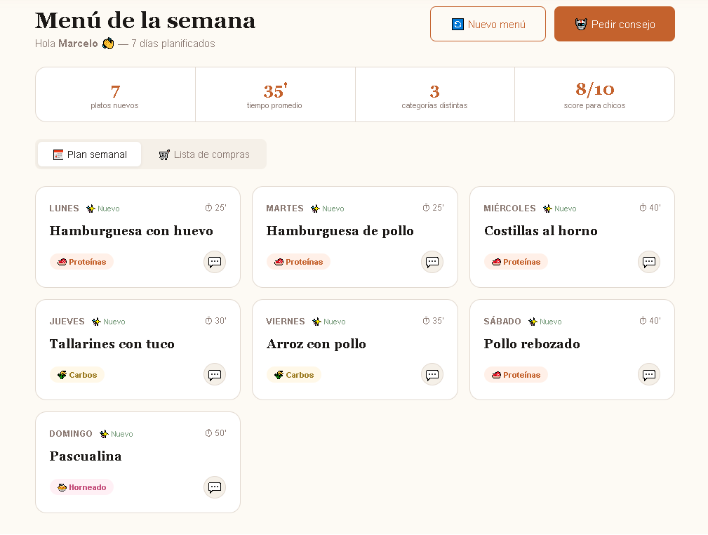

# CaseroAI — Planificador de Comidas con IA para familias latinoamericanas

> Proyecto desarrollado en 72 horas para el **ALGOfest Hackathon 2026** — AI & Machine Learning Track

[](https://caseroai.vercel.app)
[](https://react.dev)
[](https://anthropic.com)
[](https://firebase.google.com)
[](https://vercel.com)



---

## El problema

Cada día, millones de familias se enfrentan a la misma pregunta: **¿Qué cocinamos hoy?**

Los planificadores de comidas existentes son genéricos, están en inglés, y no tienen en cuenta cómo compran y cocinan realmente las familias latinoamericanas — con ingredientes del almacén de la esquina, presupuesto ajustado, y miembros de la familia con gustos muy distintos.

---

## La solución

CaseroAI es un planificador semanal de comidas impulsado por IA que:

- **Genera planes de 7 días** personalizados con un algoritmo de restricciones
- **Se adapta** a las preferencias y restricciones de cada integrante de la familia
- **Introduce nuevos platos gradualmente** a los comedores selectivos mediante un sistema de scoring progresivo
- **Consolida los ingredientes** en una lista de compras inteligente
- **Sugiere cuándo ir al super** según los horarios del comercio local
- **Cocina latinoamericana como ciudadana de primera clase** — recetas argentinas, latinas y caseras

---

## Stack tecnológico

| Capa | Tecnología |
|------|-----------|
| Frontend | React 18 + Vite |
| IA | Anthropic Claude API (claude-sonnet) |
| Base de datos | Firebase Firestore |
| Hosting | Vercel — CI/CD automático via GitHub |

---

## Arquitectura

```
src/
├── components/
│   ├── MealPlan/       — Plan semanal, lista de compras, chat con el chef IA
│   └── Onboarding/     — Configuración familiar y preferencias
├── context/            — Estado global de la familia y el plan
├── services/           — Integración con Claude API y Firebase
├── App.jsx             — Router principal
└── main.jsx
```

---

## Variables de entorno

```
VITE_ANTHROPIC_API_KEY=
VITE_FIREBASE_API_KEY=
VITE_FIREBASE_AUTH_DOMAIN=
VITE_FIREBASE_PROJECT_ID=
VITE_FIREBASE_STORAGE_BUCKET=
VITE_FIREBASE_MESSAGING_SENDER_ID=
VITE_FIREBASE_APP_ID=
```

---

## Correr localmente

```bash
git clone https://github.com/delsastrem/caseroai
cd caseroai
npm install
cp .env.example .env   # completar con tus credenciales
npm run dev
```

---

## Contexto del proyecto

Desarrollado en solitario en 72 horas durante el ALGOfest Hackathon 2026. Nació de un problema real: soy trabajador por turnos rotativos, padre de dos hijos, y la pregunta "¿qué cocinamos?" es una batalla diaria en casa.

La app usa la Claude API para generar planes de comida conversacionales adaptados al perfil de cada familia, con especial foco en la cocina argentina y latinoamericana.

---

## Autor

**Marcelo Delsastre** — [@delsastrem](https://github.com/delsastrem) — Buenos Aires, Argentina
